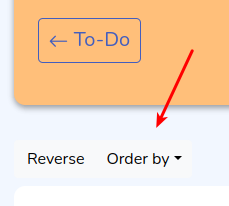
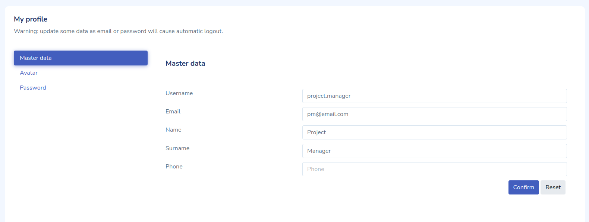
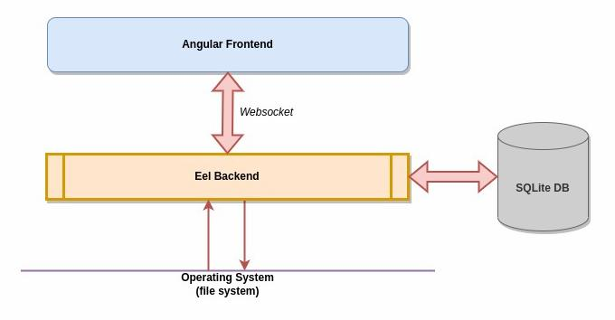

# Taskup

**Taskup** helps to manage task of your projects.

This is a university project for teaching object-oriented programming at UniMoRe university (a.y. 2022/2023).


- [Taskup](#taskup)
  * [Get Started](#get-started)
    + [Dependencies](#dependencies)
    + [Run](#run)
      - [Modality](#modality)
    + [Settings](#settings)
- [Documentation for Users](#documentation-for-users)
  * [Roles Overview](#roles-overview)
  * [Task Dashboard](#task-dashboard)
    + [Order by](#order-by)
    + [Priority](#priority)
    + [More details](#more-details)
    + [Labels](#labels)
    + [Create a New Task](#create-a-new-task)
  * [User Profile](#user-profile)
  * [Manage Task Status, Task Label, Users and Roles](#manage-task-status-task-label-users-and-roles)
- [Documentation for Developers](#documentation-for-developers)
  * [How to generate Sphinx documentation?](#how-to-generate-sphinx-documentation)
  * [Keyword](#keyword)
  * [App](#app)
    + [Eel and WebSocket](#eel-and-websocket)
      - [Exposer](#exposer)
      - [Webserver](#webserver)
  * [Database and Entities](#database-and-entities)
    + [DBManager](#dbmanager)
    + [BEM](#bem)
    + [EntitiesManager](#entitiesmanager)
    + [User, Task, TaskLabel and so on Managers](#user-task-tasklabel-and-so-on-managers)
    + [QueryBuilder](#querybuilder)
    + [Trigger](#trigger)
  * [Frontend](#frontend)
    + [Services](#services)
    + [EntityApiService](#entityapiservice)
    + [Task](#task)
  * [Help the Open Source Community](#help-the-open-source-community)
    + [How to run Angular and Eel together in develop mode?](#how-to-run-angular-and-eel-together-in-develop-mode)
    + [How to set alias in Eel?](#how-to-set-alias-in-eel)
  * [Credits, libraries and plug in used](#credits-libraries-and-plug-in-used)

## Get Started

To get started this app is necessary install the required dependencies.

### Dependencies

To run this project are required the followings dependencies:

- [Python 3.10+](https://www.python.org/downloads/)
- [Eel](https://pypi.org/project/Eel/) (Python module to create frontend)
- [Colorama](https://pypi.org/project/colorama/) (Python module for Logger)
- [Chromium](https://www.chromium.org/) based software (as Google Chrome or Firefox)

### Run

After dependencies installation, open this app is possible using `main.py`.

`main.py` accepts some parameters based on execution modality.

#### Modality

- `run`, `r` or _nothing_: launch the application
- `demo`, `d` `<path>`: launch application with a demo database in path specified, path has to the last parameter 
  - `-f`: force erase if there is already a database
  - `-o`: open app at end
- `init`, `i`: initialize this app in users projects
  - `-f`: force reinitialization
- `help`, `h`: print help 
- `version`, `v`: print version

### Settings

It is possible to manage application settings using `settings.json`, this file have to create in _root directory_ (same level of `main.py`).
Inserting custom settings in it, they override base default settings (managed by `SettingsManager`).

The settings available are:
- `vault_path`, a string which contains the path of directory in which the file to store user credentials will be saved
- `current_project_path`, a string which contains the project path which will be loaded at startup
- `projects_stored_paths`, a list of strings which contains the paths of already opened projects
- `use_localtime`, boolean value which indicates if database must use *localtime*
- `debug`,  boolean value (default False) which indicates if the app must run in *debug mode* (i.e. use 4200 port for front-end)
- `frontend`, a string which represents path of *front-end directory*
- `frontend_start`, a string which represents the *entry point of front-end*
- `frontend_debug_port`, an integer value which represents the port of frontend in debug mode
- `port`, an integer value which represents the port of Eel webserver
- `db_name`, a string which represents the app database name
- `verbose`, a boolean value to make verbose running
- `projects_paths_stored`, a list of strings that contains all project paths to fast-open them

# Documentation for Users

This documentation is written for the app's users.
This app is a task manager for small and big projects, in particular for software projects.
From now on we will call the project to manage _MyProject_.

## Roles Overview

By default, the users has one role between the following roles:

- **Project Manager**, usually an only user who manages _MyProject_
- **Supervisor**, users named by PM to manage _MyProject_
- **Teammate**, simple teammates
- **Base**, usually _guest users_ of same company, and they don't develop continuously _MyProject_
- **External**, role for external of company users

Each role has a list of different permissions where PM has all permissions, while External doesn't have any permissions.
Usually the PM is the user who has created _MyProject_, he is able to create other users and manages them, Task options and so on.

The roles can be modified in a second moment if the user has specific permission.

## Task Dashboard


The _Dashboard_ is the application core. It is used to manage tasks.
Based on user's permission, the logged user is able to see all tasks or only assigned task.
Dashboard is divided in a different section for each task status. For example _To-do_ state, _Doing_ state, _Done_ state and so on.
Dashboard has a _sticky_ header used to keep in mind the current task status visualized, the number of task for current status and it also has two buttons to go in the default _next_ and _prev_ status. For example, _doing_ status may have _to-do_ as previously status and _done_ as next status.
In addition, other functionality are present using the button in top-right side.


In the dashboard, each task has its own card which shows all task's information.

> Task can be refreshing using the button on right side.


### Order by

Each section can be ordered by **priority** or **deadline** (ascending or descending) using the specif button.



### Priority

Each task has a priority value which indicates the _priority of task_, the priority increases with the corresponded number value.
This value is shown in the badge on left of task name.


### More details

The _More details_ section is a collapsible section which is used to show secondary information of the task as author, creation date, identitier task code and so on.

### Labels


Labels are a fast visible identities. Usually, they are used to group task of common work areas, for example the _Front-end labels_ is assigned to all task which describes _a task to do for front-end of MyProject_.
The task's labels are shown in top of the task's card.
Using "+" button at the end of labels list is possible to add a new label.
Clicking on a label is possible remove that label.

### Create a New Task

Create a new task is simple, clicking on _FAB_ button on bottom-right a modal will be showing.
It is used to insert name, description and priority of the new task. Checking the checkbox is possible self-assign to task. 

## User Profile

Each logged user is able to manage own profile using _My Profile_ page. It can be accessed through dropdown menu on header avatar:


From _My Profile_ page is possible to edit user master data (name, surname, username, email and so on), avatar color and the password.



> WARNING: when a user edits email or password, he will have logged out.

## Manage Task Status, Task Label, Users and Roles

Having the specific permissions, a user as PM is able to manage task status, task label,users and roles.

There are the corresponding pages to manage the single things. Each page is shown if only if the corresponding permission is satisfied. UI is the same for all.
From these pages is possible:

- Create a new resource
- Edit resources
- Delete resources

For example, the _Manage Task Label_ page is the followings:


In addition, if there are a lot of resources, it is possible to use filters.

# Documentation for Developers

This is a base and simple documentation to illustrate this project for old and new developers.
To watch a full documentation see the _Sphinx documentation_.

## How to generate Sphinx documentation?

To run Sphinx doc:

1. Go in /doc directory
2. Run `sphinx-apidoc -o source/ ..` or `sphinx-apidoc -o source/ ../lib` to refresh only lib packages
3. Run `make html`
4. Go in `doc/build/html`

## Keyword

- **Base Directory:** _this_ project directory path
- **Project Directory:** the managed project path
- **Work Directory:** the work directory inside _project directory_

## App



### Eel and WebSocket

This project uses the [Eel library](https://github.com/python-eel/Eel) to send data between client (frontend) and server
(Python). Eel is a little Python library for making simple Electron-like offline HTML/JS GUI apps, with full access to Python capabilities and libraries.

Eel hosts a local webserver, then lets you annotate functions in Python so that they can be called from Javascript, and vice versa.


The App class in `app.py` implements `__init__` and `start` methods to load and start Eel. It takes the configuration files
from `settings.json` using the Settings class.
In `__init__` it uses the Exposer class to expose all methods for frontend.

#### Exposer

Exposer is the class which provides to expose methods using the "expose" methods of Eel. In particular, 
Eel provides two methods to expose a function (other than `@expose` decorator):

- `expose()` which exposes method (and function) as it is
- `_expose()` which is a _protected_ method of Eel library and expose method (and function) with an _alias_, it is so important because the entities managers have
  the same methods name to create, read, update and so on entities, so each manager has the own prefix (e.i. UsersManager has "user_")
  see [here](#how-to-set-alias-in-eel).

#### Webserver

The Eel's webserver implements a [**Web Socket**](https://en.wikipedia.org/wiki/WebSocket) to send data.
It is hosted on 8000 port (see `app.py`), so in develop mode the frontend have to host on different port, for example, 4200 port.
See [here](#how-to-run-angular-and-eel-together-in-develop-mode).

Since the webserver is implemented with web socket there can only be **one** data transfer at a time.

## Database and Entities


### DBManager

**DBManager** is the class used to provide connect with the database.
Moreover, it allows to create the base structure of the database: tables and relations between them.

### BEM

**BEM** is the base class for the _entities models_, it implements some common and useful methods.

### EntitiesManager

**EntitiesManager** is the base class for the _entities managers_, that are classes that manage entities (find, create, delete, ...).

### User, Task, TaskLabel and so on Managers

The entities (**User, Task, TaskLabel, ...**) are the classes used to manage the single entity of database.
Each of them has the base shared methods and some specific methods. For example, _TaskManager_ and _TaskLabelManager_ have `add_label` method to add a label on specific task.

### QueryBuilder

**QueryBuilder** is a custom _query builder_ based on Python `sqlite3` that implements the common utilities to build a query with Python code instead of SQL.
It supports binding with specific method as `enable_binding`.

### Trigger

During the table creation (using db component named _Table_, which accepts a list of _Field_ and other parameters as _FKConstraint_ and _Trigger_) in base structure creation are configured a set of **triggers**.
The triggers are used to update the **updated_at** field of task table each time that a component linked with task is modified.

There are 3 triggers (_on update, on create and on delete_) for the following tables: **todo_item**, **pivot assignment** and **pivot labels**. While for the task table there is only the trigger _on update_ (because if a task is deleted or created is pointless updating the field).

## Frontend

The frontend of this application uses the _Angular framework_.
Angular is a TypeScript-based, free and open-source web application framework led by the Angular Team at Google and by a community of individuals and corporations.
The frontend is structured in:

- **page** contains final pages as _login page_ or _home page_
- **widget** contains simple widgets shared between pages as _user avatar_
- **service** contains the _services_ that are used to implements shared methods and communication with backend
- **model** contains a list of interface for objects that also represents entities data to show
- **directive** contains custom Angular directives

### Services

The services in Angular are used to manage connections with backend and provide some other functionality to app.
To communicate with Eel backend was implemented `EelService` which uses a global declared variable `eel` to provide the main class method `call` to call Python exposed methods.

### EntityApiService

The `EntityApiService` is a service which is used to share common methods between entity services.
It uses a _generic type_ which represents the specif _entity model_, so it can be used in some methods.
Each method returns a _Promise of Observable_, the observable is connected with websocket of backend.
To call the specific method of entity services, this class uses _readonly abstract variable_, each child service override them. 

For example the `find` method, which returns data of an entity searched by its id:

```typescript
export abstract class EntityApiService<T> {

  readonly abstract ALL: string;

  constructor(public eelService: EelService) { }

  public async find(id: number): Promise<Observable<T>> {

    return this.eelService.call(this.FIND, id);
  }
}
```

Using, for example, TaskService: 

```typescript
this.taskService.find(id).then((respose) => {
    respose.subscribe({
      next: (task: TaskModel) => {
        // ...
      }
    })
})
```

In addition, the _entities services_ as `TaskService` or `UserService` have other specific methods.
For example, `TaskService` has `addAssignment` method:

```typescript
public async addAssignment(taskId: number, userId: number): Promise<Observable<boolean>> {

    return this.eelService.call(this.ADD_ASSIGNMENT, taskId, userId);
}
```

### Task

The task visualization is made using a set of widgets:

- **TaskPreview** is the main component which is a card with all task information as title, description and so on
- **TaskPreviewList** is a component which display a list of task passed in a set of _TaskPreview_
- **TaskTodo** and **TaskTodoList** are the components used to show the list of todo-item for each task 

## Help the Open Source Community

### How to run Angular and Eel together in develop mode?

1. Run Angular frontend with `ng serve` using 4200 port (the default port)
2. Set Eel using whatever directory, but using `{ 'port': 4200 }` as start file!
3. Set another port (i.e. 8000) in Eel `.start(...)`
4. Run Eel python script

### How to set alias in Eel?

```python
import eel

class MyClass:
   def my_method(self):
      pass

my_class = MyClass()
eel._expose("other_name", my_class.my_method)
```

Watch out "**_**" in `_expose(...)`, it is different from `expose(...)`

## Credits, libraries and plug in used

- Bootstrap framework
- Bootstrap icon
- Eel library
- Sqlite3 library
- Colorama library
- Mazer template